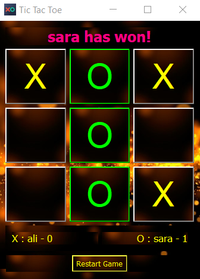
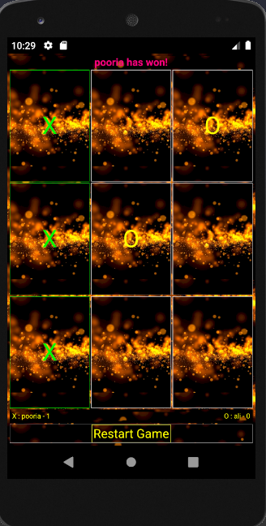

# TicTacToe 
It's cross_platform game. so you can run it on "Window","Mac","Linux" and... 
also you can this for "Andriod" ,"Ios" and... 
Attention: for run it you need Qt creator
 

UI :   XML && DesignMode
 

Core :   C++14 && Qt 5.14.0
 

Usage:   

